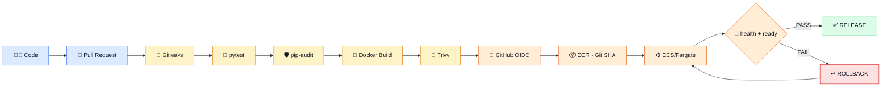
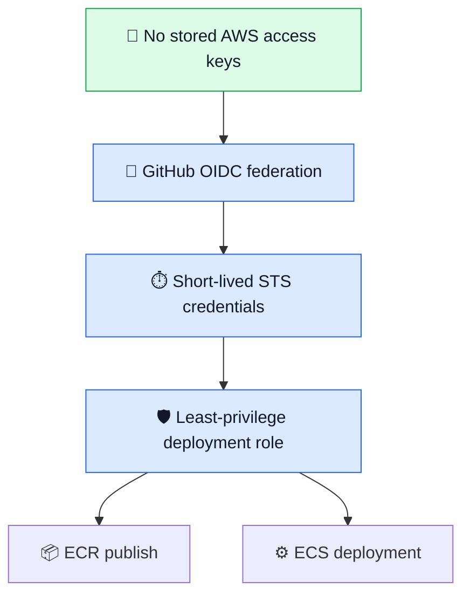

# 🚀 MADAR — CI/CD & DevSecOps

<p align="center">
  
  
  
  
</p>

<p align="center">
  
  
  
  
  
</p>

> [!NOTE]
> **Phase 06 is completed, validated, and cleaned.** This repository records the delivery pipeline I built, the security gates I proved, the controlled failure I triggered, the rollback I exercised, and the final AWS cleanup.

## 🧭 Choose your path

| | Goal | Start here |
|---|---|---|
| 👀 | **Understand the project in 5 minutes** | Keep reading this README |
| 🛠️ | **Rebuild Phase 06 from zero** | [`runbooks/00-execution-runbook.md`](runbooks/00-execution-runbook.md) |
| ↩️ | **Recover a failed ECS release** | [`runbooks/90-rollback-runbook.md`](runbooks/90-rollback-runbook.md) |
| 🧹 | **Destroy the temporary runtime safely** | [`runbooks/99-cleanup-runbook.md`](runbooks/99-cleanup-runbook.md) |
| 🧠 | **Understand the engineering decisions** | [`decisions/`](decisions/) + [`docs/`](docs/) |
| 📸 | **Inspect the proof** | [`evidence/README.md`](evidence/README.md) |

```text
README = understand  →  ADRs/docs = understand why  →  Runbooks = rebuild / recover / clean
```

## 🎯 Mission

Phase 05 proved that MADAR's legacy workload could run as a container. Phase 06 turned that container into a **controlled software-delivery system**: every change is tested and scanned, every published image maps to a Git commit, AWS authentication uses short-lived credentials, releases are validated after deployment, and failed releases have an exercised recovery path.

## 🌈 Delivery journey



## 🏆 Final scorecard

| Gate | Capability | Result |
|---|---|---:|
| 🔀 | Protected PR delivery | 🟢 **VALIDATED** |
| 🧪 | Unit + readiness tests | 🟢 **VALIDATED** |
| 🔐 | Gitleaks secret scanning | 🟢 **VALIDATED** |
| 🛡️ | `pip-audit` dependency gate | 🟢 **VALIDATED** |
| 🔎 | Trivy HIGH/CRITICAL image gate | 🟢 **VALIDATED** |
| 🔑 | GitHub → AWS OIDC | 🟢 **VALIDATED** |
| 📦 | Immutable Git-SHA ECR images | 🟢 **VALIDATED** |
| ⚙️ | Automated ECS deployment | 🟢 **VALIDATED** |
| 🚦 | Health + readiness validation | 🟢 **VALIDATED** |
| 🚨 | Controlled failed release | 🟢 **VALIDATED** |
| ↩️ | Rollback + recovery | 🟢 **VALIDATED** |
| 🧹 | Runtime cleanup | 🟢 **VALIDATED** |

## ❤️ Liveness ≠ Readiness

| Signal | Question answered | Healthy result |
|---|---|---|
| ❤️ `/api/health` | Is the Flask process alive? | `HTTP 200` |
| 💚 `/api/ready` | Can the app reach PostgreSQL and serve real traffic? | `HTTP 200` + database connected |

> [!IMPORTANT]
> A process can be **alive** while its database dependency is unavailable. Phase 06 deliberately proved that distinction during the rollback test.

## 🔐 Security model



| Control | Protects against |
|---|---|
| 🔐 **Gitleaks** | committed secrets |
| 🧪 **pytest** | broken application behavior |
| 🛡️ **pip-audit** | vulnerable Python dependencies |
| 🔎 **Trivy** | HIGH/CRITICAL container vulnerabilities |
| 🔑 **OIDC** | long-lived AWS credentials in GitHub |

## 🧯 The failure story

```text
🟢 known-good :3
      ↓
🔴 controlled bad revision :4
      ↓
❤️ /api/health = 200
💔 /api/ready  = 503
      ↓
🚨 release gate detects failure
      ↓
↩️ rollback to :3
      ↓
💚 /api/ready = 200 · database connected
```

I intentionally deployed a task-definition revision with an invalid database host. Flask remained alive, but readiness failed exactly as designed. The release was rejected and ECS returned to the known-good revision. This made rollback an **observed recovery path**, not a diagram-only claim.

## 📸 Evidence gallery

| 🔑 OIDC → ECR | 📦 Git-SHA traceability |
|---|---|
|  |  |

| ⚙️ Automated deployment | 🚚 Restored live data |
|---|---|
|  |  |

| ↩️ Controlled rollback | 🧹 Final cleanup |
|---|---|
|  |  |

<details>
<summary><strong>🖼️ Open the rest of the evidence gallery</strong></summary>

### 🛡️ Branch protection


### 🔎 Container scan


### 🗄️ Database restore + relock


### ✅ Pre-AWS CI closeout


### 🚦 Readiness CI


### 🚨 Negative secret-gate test


</details>

## 🧩 Validated AWS runtime

```text
🌐 Internet
   ↓ HTTP :80
⚖️ ALB
   ↓ :8080
⚙️ ECS/Fargate
   ↓ :5432
🗄️ RDS PostgreSQL
```

The temporary lab used the default VPC in `us-east-1`, an HTTP ALB, ECS/Fargate, ECR, single-AZ RDS PostgreSQL, Secrets Manager, CloudWatch Logs, scoped security groups, and IAM/OIDC roles. It was intentionally short-lived and removed after validation.

> [!WARNING]
> This was a **validation lab**, not a claim of final production topology. Production direction includes HTTPS/ACM, stronger environment/network boundaries, HA according to RTO/RPO, and least-privilege database identities.

## 🧹 Cleanup outcome

| Resource family | Final state |
|---|---:|
| ECS service / cluster | 🗑️ **DELETED** |
| ECR repository | 🗑️ **DELETED** |
| ALB / listener / target group | 🗑️ **DELETED** |
| Phase 06 RDS + managed secret | 🗑️ **DELETED** |
| Phase 06 IAM / OIDC | 🗑️ **DELETED** |
| Phase 06 security groups | 🗑️ **DELETED** |
| Default VPC + default subnets | 🟡 **KEPT** |
| Phase 03 AMI / snapshot / S3 | 🟡 **KEPT** |

## 🗺️ Repository map

| Path | Purpose |
|---|---|
| `.github/workflows/` | 🚀 CI/CD + controlled rollback |
| `app/` | 🐍 Flask workload + Docker + tests |
| `docs/` | 📚 Architecture + security implementation record |
| `decisions/` | 🧠 Architecture Decision Records |
| `runbooks/` | 🛠️ Rebuild + ↩️ rollback + 🧹 cleanup |
| `checklists/` | ✅ Preflight + execution guardrails |
| `evidence/` | 📸 Screenshots + evidence index |
| `CURRENT-STATE.md` | 📍 Authoritative final status |

## 🧠 Evidence standard

> 🟣 **PLANNED** = design only  
> 🔵 **IMPLEMENTED** = code/configuration exists  
> 🟢 **VALIDATED** = observed execution proves the behavior

---

<p align="center"><strong>🚀 Build safely · 🔐 prove the gates · 🚨 test failure · ↩️ recover · 🧹 clean up</strong></p>
