# 🚀 MADAR — CI/CD & DevSecOps

> **Phase 06 · Secure software delivery for the MADAR containerized workload**  
> ✅ **Status: COMPLETED & VALIDATED** · 🔐 **OIDC** · 🛡️ **DevSecOps gates** · 🐳 **ECR** · ⚙️ **ECS/Fargate** · ↩️ **Rollback tested** · 🧹 **AWS runtime cleaned**


## 🎯 What I built

Phase 05 proved the MADAR application could run as a container. Phase 06 turned that workload into a **controlled software-delivery system**: every change is tested, scanned, built, traceable to a Git commit, deployed with short-lived AWS credentials, validated after release, and recoverable through rollback.

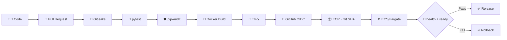

## 🏆 Final result

| Capability | Result | Proof |
|---|---:|---|
| Pull-request CI | ✅ VALIDATED | Required checks on protected `main` |
| Unit + readiness tests | ✅ VALIDATED | `/api/health` and `/api/ready` tested independently |
| Secret scanning | ✅ VALIDATED | Gitleaks blocked a synthetic secret in an unmerged PR |
| Dependency scanning | ✅ VALIDATED | `pip-audit` blocking gate |
| Container scanning | ✅ VALIDATED | Trivy HIGH/CRITICAL policy |
| GitHub → AWS authentication | ✅ VALIDATED | OIDC + short-lived credentials, no long-lived AWS keys |
| Image traceability | ✅ VALIDATED | Immutable ECR image tags based on Git SHA |
| Automated ECS deployment | ✅ VALIDATED | Successful GitHub Actions deployment |
| Post-deploy validation | ✅ VALIDATED | Liveness + database readiness checks |
| Controlled failed release | ✅ VALIDATED | Bad DB host produced expected readiness failure |
| Rollback & recovery | ✅ VALIDATED | ECS returned from task definition `:4` to known-good `:3` |
| Cleanup | ✅ VALIDATED | Temporary Phase 06 AWS runtime removed |

## ❤️ Liveness vs readiness

The dashboard and release checks intentionally use two different signals:

- **`/api/health`** → the Flask process is alive and responding.
- **`/api/ready`** → the application can actually reach PostgreSQL and is ready for real traffic.

That separation matters during real incidents: an application can be alive while its database dependency is unavailable.

## 🔐 Security model

```text
No stored AWS access keys
        ↓
GitHub OIDC federation
        ↓
Short-lived STS credentials
        ↓
Least-privilege GitHub Actions role
        ↓
ECR publish + ECS deployment only
```

The pipeline uses four independent blocking controls because each answers a different question: **Gitleaks** protects secrets, **pytest** protects application behavior, **pip-audit** protects Python dependencies, and **Trivy** protects the built container image.

## 📸 Evidence gallery

### 🔑 OIDC → ECR publication
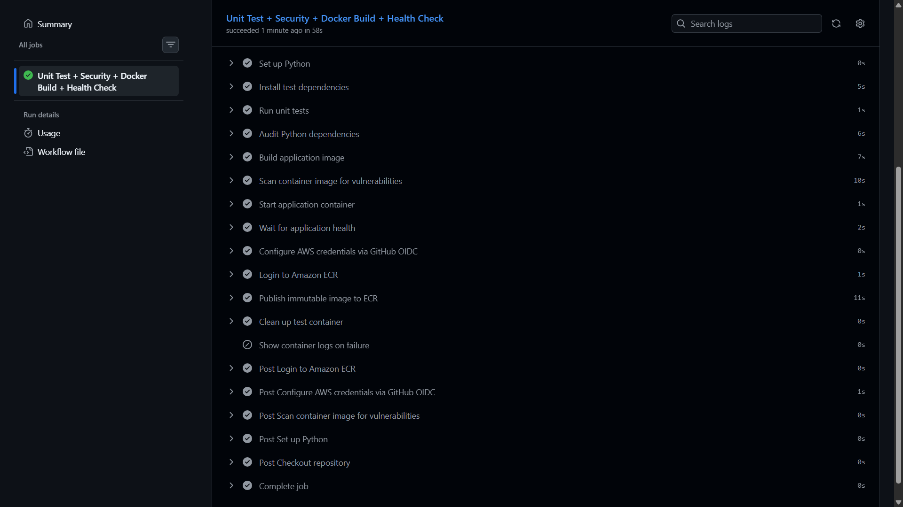

### 📦 Immutable Git-SHA image traceability
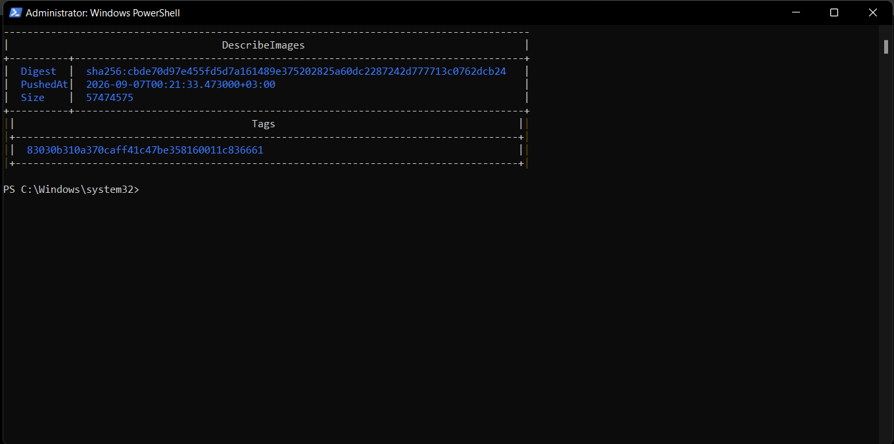

### ⚙️ Automated ECS deployment
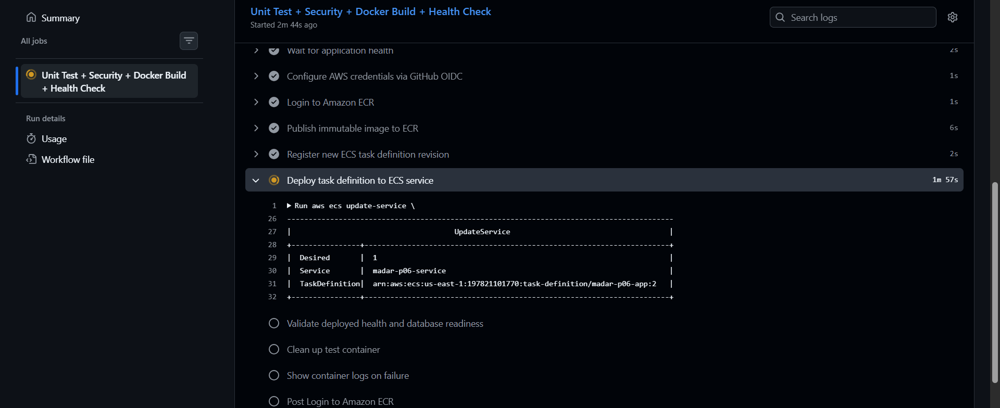

### 🚚 Live workload with restored operational data
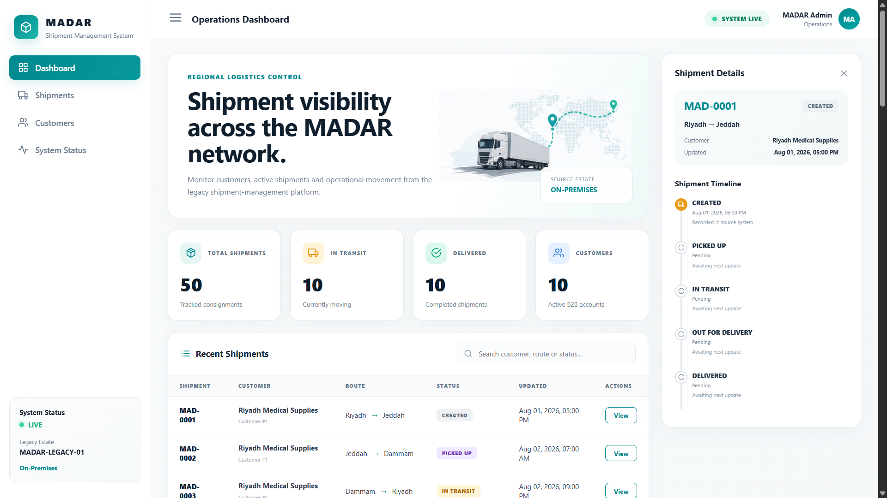

### ↩️ Controlled failure and rollback recovery
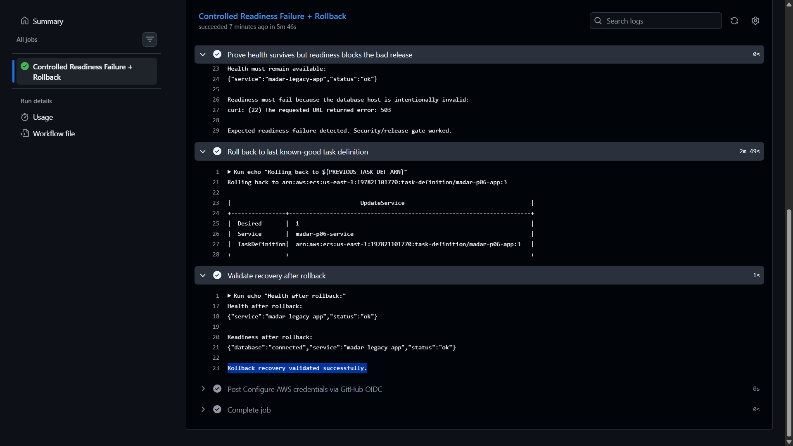

### 🧹 Final cleanup verification
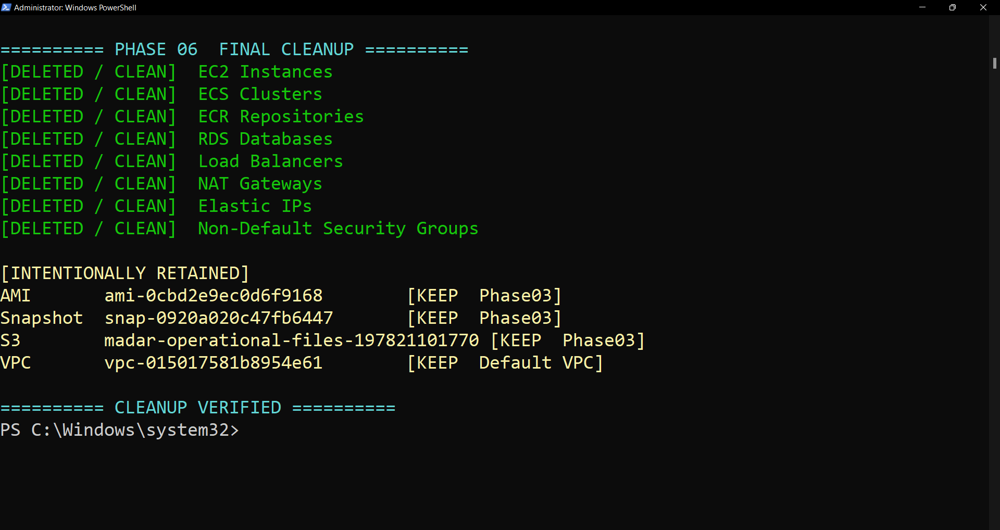

<details>
<summary><strong>🖼️ View the rest of the Phase 06 evidence</strong></summary>

#### 🛡️ Branch protection
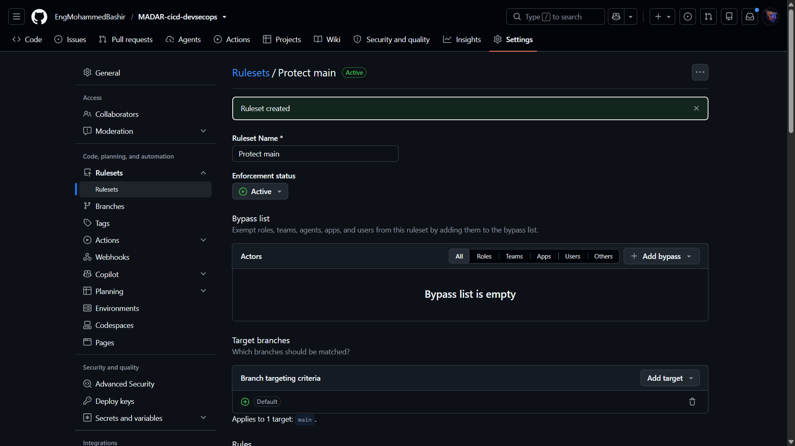

#### 🔎 Container scan
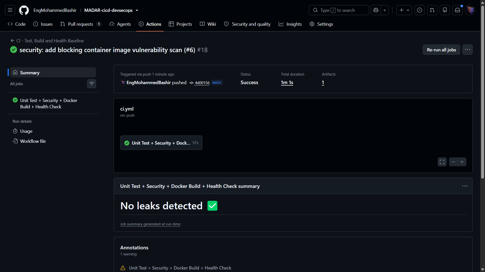

#### 🗄️ Database restore and relock
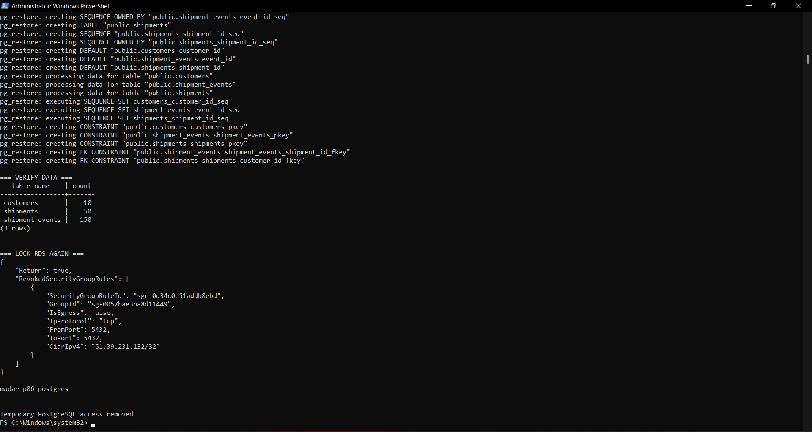

#### ✅ Pre-AWS CI closeout
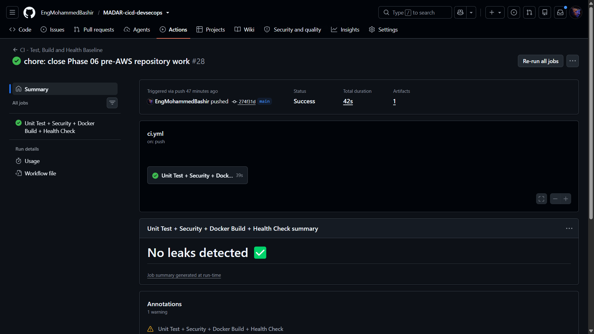

#### 🚦 Readiness CI
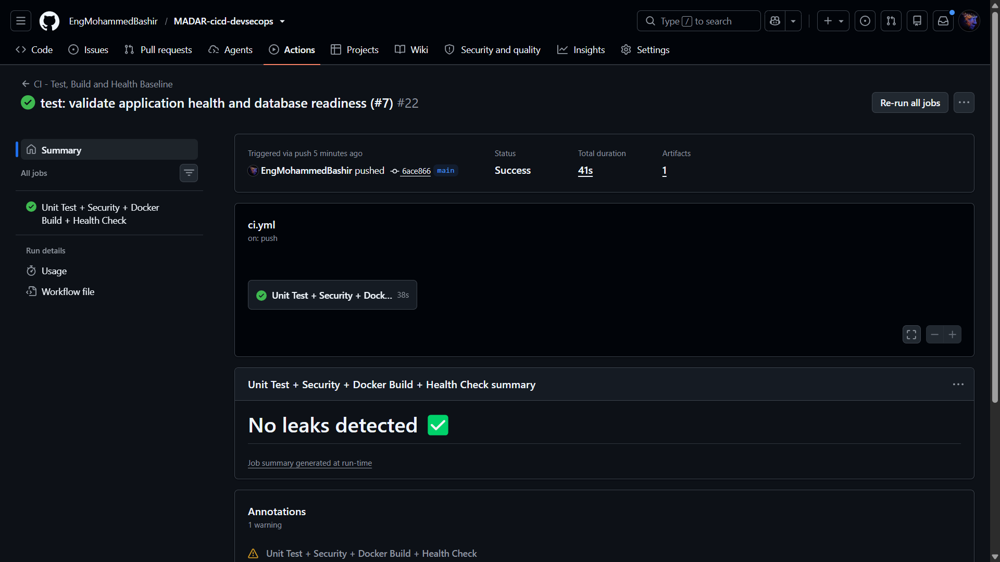

#### ✅ Required PR check
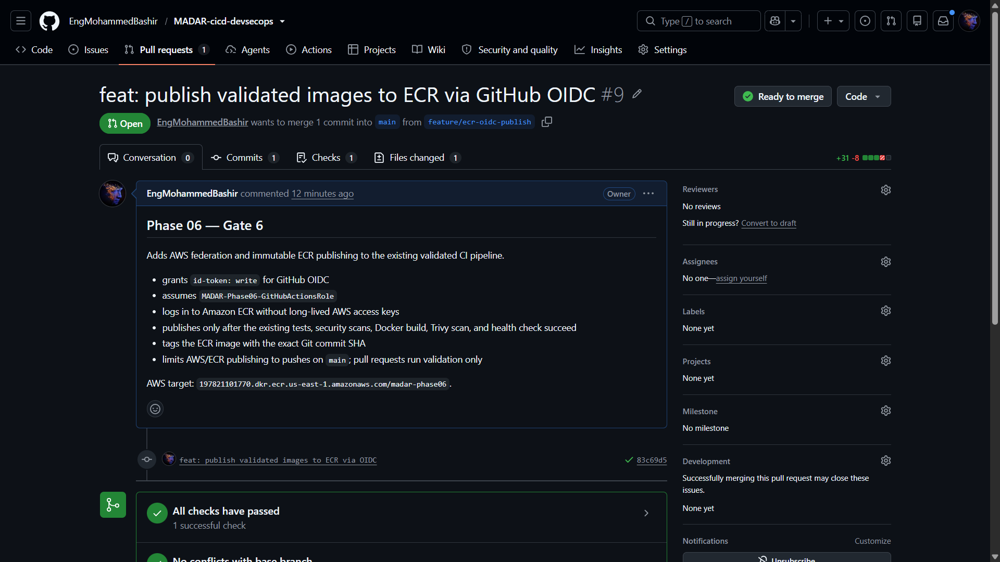

#### 📊 Runtime validation summary
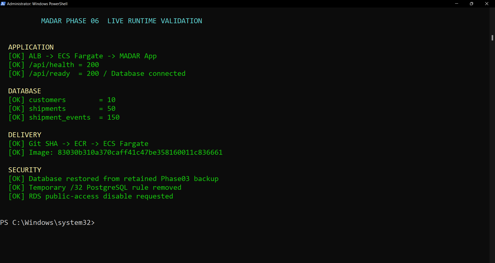

#### 🚨 Negative secret-gate test
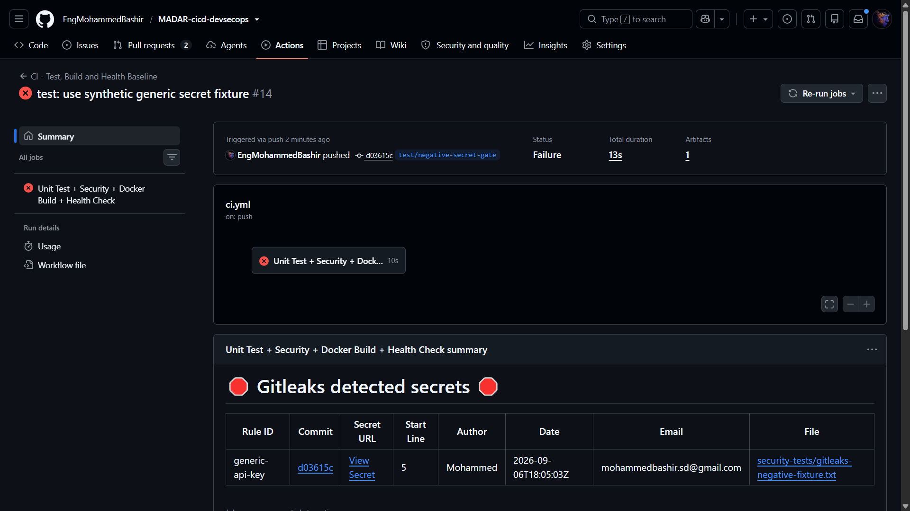

</details>

## 🧩 AWS runtime used for validation

The temporary validation environment used the default VPC in `us-east-1`, an internet-facing HTTP ALB, ECS/Fargate, ECR, a single-AZ PostgreSQL RDS instance, CloudWatch Logs, scoped security groups, and IAM/OIDC roles. The environment was intentionally short-lived and removed after validation.

The retained Phase 03 recovery baseline remains separate from this phase: the migration AMI, its EBS snapshot, and the operational S3 bucket are preserved for later portfolio work.

## 🧹 Cleanup outcome

After validation I removed the temporary Phase 06 ECS service and cluster, ECR repository, ALB/listener/target group, RDS instance and managed secret, CloudWatch log group, task definitions, IAM roles/policies, OIDC provider, DB subnet group, and Phase 06 security groups. The default VPC/subnets were intentionally preserved because they are account defaults and do not incur charges simply by existing.

## 🗺️ Repository map

| Path | Purpose |
|---|---|
| `.github/workflows/` | Production CI/CD and controlled rollback workflows |
| `app/` | Flask workload, Docker build and automated tests |
| `docs/` | Architecture, security controls and implementation record |
| `decisions/` | Architecture Decision Records |
| `runbooks/` | Execution, rollback and cleanup procedures |
| `checklists/` | Preflight and execution guardrails |
| `evidence/` | Screenshots and evidence index |
| `CURRENT-STATE.md` | Final authoritative status |

## 🧠 Evidence standard

> **PLANNED** = design only · **IMPLEMENTED** = code/configuration exists · **VALIDATED** = observed execution proves the behavior.

Phase 06 is closed only because the delivery path, security gates, failure behavior, recovery path, and cleanup were all observed and documented.
