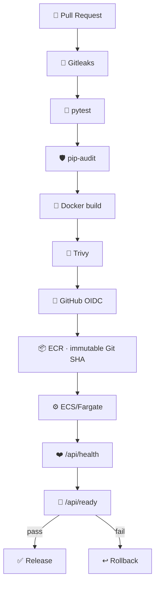

# 🏗️ Pipeline Architecture



## 🔐 Trust boundaries

GitHub never stores long-lived AWS access keys. The workflow requests a short-lived STS session through the GitHub OIDC provider. The deployment role can publish only to the Phase 06 ECR repository, update only the Phase 06 ECS service, register task definitions, and pass only the ECS execution role.

## 🌐 Runtime network path

```text
Internet → ALB :80 → ECS/Fargate :8080 → PostgreSQL :5432
```

Security groups enforced each hop. RDS was returned to `PubliclyAccessible=False` after the one-time restore path was complete.

## 🚦 Operational signals

`/api/health` proves process liveness. `/api/ready` proves the database dependency is usable. The controlled rollback test demonstrated why those signals must remain separate.
