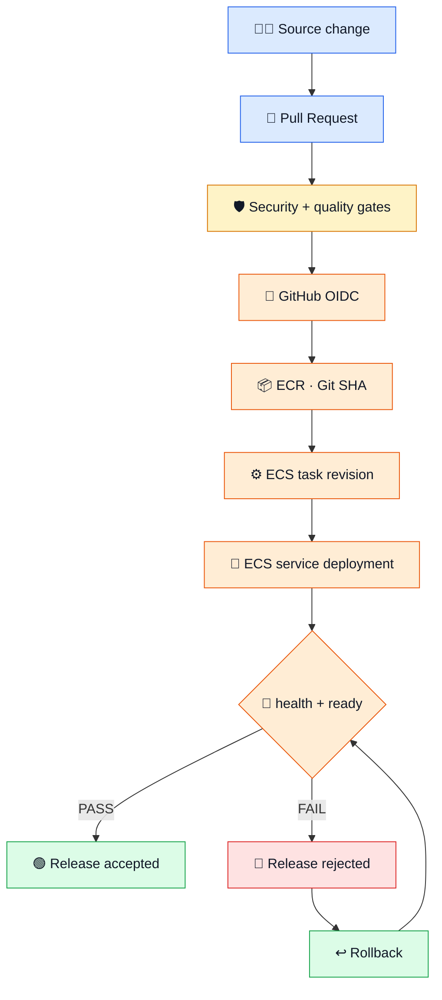

# ▶️ Phase 06 — Reproducible Execution Runbook

<p align="center">


</p>

> [!NOTE]
> **Purpose:** this is my operator/rebuild guide. The README tells the portfolio story; this file records how I can reproduce Phase 06 without relying on chat history.

## 🧭 Operator map

| Step | Milestone | Exit signal |
|---:|---|---|
| 0️⃣ | 🧰 Preflight | identity + region + tools verified |
| 1️⃣ | 🐍 App baseline | tests pass; health/readiness behavior understood |
| 2️⃣ | 🛡️ DevSecOps gates | Gitleaks + pytest + pip-audit + Trivy green |
| 3️⃣ | 🔑 OIDC | GitHub gets short-lived AWS credentials |
| 4️⃣ | 📦 ECR | immutable Git-SHA image path ready |
| 5️⃣ | 🌐 Network | ALB → ECS → RDS boundaries established |
| 6️⃣ | 🗄️ PostgreSQL | 10 / 50 / 150 rows restored and DB relocked |
| 7️⃣ | ⚙️ ECS/Fargate | task runtime + logs + secret injection ready |
| 8️⃣ | ⚖️ ALB + Service | live workload reachable |
| 9️⃣ | 🚀 Automated deploy | push to `main` deploys + validates |
| 🔟 | 🚨 Failure drill | bad release rejected |
| 1️⃣1️⃣ | 📸 Evidence | meaningful proof recorded |
| 1️⃣2️⃣ | 🧹 Cleanup | temporary runtime removed + audited |

## 🌈 End-to-end mental model



## 💰 Safety / cost boundary

> [!WARNING]
> The AWS runtime is intentionally temporary. Before rebuilding: verify account, region, credits/billing and the cleanup plan. **Never** paste AWS passwords, database passwords, access keys or tokens into the repository.

The validated lab used account `197821101770` in `us-east-1`. Deleted resource IDs must be replaced with newly created values when rebuilding.

---

## 0️⃣ 🧰 Preflight

🎯 **Goal:** prove workstation and AWS context before changing anything.

```powershell
aws sts get-caller-identity
aws configure get region
git --version
docker --version
```

🧠 **Why:** most dangerous mistakes start with the wrong account/region or an assumed local dependency.  
✅ **Expected:** correct AWS identity, `us-east-1`, Git available, Docker available.

```powershell
git clone https://github.com/EngMohammedBashir/MADAR-cicd-devsecops.git
cd MADAR-cicd-devsecops
git checkout -b feature/<short-purpose>
```

🔀 **Why a feature branch?** `main` is protected; changes reach it through a PR and required CI.

---

## 1️⃣ 🐍 Application baseline + local container proof

| Endpoint | Meaning | Expected without DB |
|---|---|---:|
| ❤️ `/api/health` | Flask process alive | 🟢 `200` |
| 💚 `/api/ready` | PostgreSQL reachable | 🔴 `503` |

```powershell
cd app
python -m pip install -r requirements-dev.txt
$env:MADAR_DB_PASSWORD="dummy-test-only"
$env:PYTHONPATH="."
python -m pytest -q
cd ..
```

```powershell
docker build -t madar-phase06-local ./app
docker run -d --name madar-p06-local -p 8080:8080 -e MADAR_DB_PASSWORD=dummy-local-only madar-phase06-local
curl.exe http://localhost:8080/api/health
curl.exe -i http://localhost:8080/api/ready
docker rm -f madar-p06-local
```

> [!TIP]
> `health=200` + `ready=503` without a real DB is **correct behavior**. It proves liveness and readiness are independent.

---

## 2️⃣ 🛡️ CI / DevSecOps gates

```text
🔀 checkout full history
   ↓
🔐 Gitleaks
   ↓
🧪 pytest
   ↓
🛡️ pip-audit
   ↓
🐳 Docker build
   ↓
🔎 Trivy HIGH / CRITICAL
   ↓
❤️ temporary-container health check
```

Useful local equivalents:

```powershell
cd app
python -m pytest -q
python -m pip_audit -r requirements.txt
cd ..
docker build -t madar-phase06-ci:local ./app
```

| Gate | Protects |
|---|---|
| 🔐 Gitleaks | secrets in Git history |
| 🧪 pytest | application behavior |
| 🛡️ pip-audit | vulnerable Python dependencies |
| 🔎 Trivy | vulnerable built image |

🚨 The Gitleaks negative test used a **synthetic** secret in an unmerged PR. Never use a real credential as a test fixture.

✅ **Exit:** required CI check is green before merge; protected `main` blocks unsafe direct flow.

---

## 3️⃣ 🔑 GitHub OIDC → AWS

🎯 **Goal:** short-lived AWS credentials with **no stored AWS access keys**.

```text
Provider URL  https://token.actions.githubusercontent.com
Audience      sts.amazonaws.com
Role          MADAR-Phase06-GitHubActionsRole
```

Validated immutable subject:

```text
repo:EngMohammedBashir@210871383/MADAR-cicd-devsecops@1356428590:ref:refs/heads/main
```

> [!IMPORTANT]
> The initial generic subject assumption did not match GitHub's emitted subject. The trust policy was corrected to the observed immutable owner/repository-ID form.

Least-privilege delivery permissions:

```text
📦 ECR authorization + scoped push actions → madar-phase06
⚙️ ECS Register/DescribeTaskDefinition
🚀 ECS Update/DescribeService → madar-p06-service only
🔐 iam:PassRole → MADAR-Phase06-ECSTaskExecutionRole only
```

Workflow permission contract:

```yaml
permissions:
  contents: read
  id-token: write
```

---

## 4️⃣ 📦 Immutable ECR registry

```powershell
aws ecr create-repository --repository-name madar-phase06 --image-tag-mutability IMMUTABLE --image-scanning-configuration scanOnPush=true --encryption-configuration encryptionType=AES256 --region us-east-1
```

🎯 **What:** creates encrypted ECR with immutable tags and scan-on-push.  
🧠 **Why:** an existing SHA tag cannot be silently replaced.  
🔗 **Traceability:** `Git commit SHA ↔ ECR tag ↔ ECS task-definition revision`.

---

## 5️⃣ 🌐 Minimum validation network

The lab reused the **default VPC** to avoid unnecessary infrastructure.

```text
us-east-1a  subnet-04e63af31360b080a
us-east-1b  subnet-0d70c1cf55218c14f
```


> [!CAUTION]
> Do **not** open ECS `8080` or PostgreSQL `5432` directly to the internet.

Validated SG names: `madar-p06-alb-sg`, `madar-p06-ecs-sg`, `madar-p06-rds-sg`.

---

## 6️⃣ 🗄️ PostgreSQL restore + relock

| Setting | Validated lab value |
|---|---|
| Identifier | `madar-p06-postgres` |
| Engine | PostgreSQL |
| Class | `db.t4g.micro` |
| Storage | `20 GiB gp3` |
| Database | `madar_legacy` |
| Topology | Single-AZ lab |
| Backups | 0-day retention for disposable lab |

Authoritative retained dump:

```text
s3://madar-operational-files-197821101770/database-backups/madar_legacy_final.dump
```

Expected reconciliation:

| Table | Rows |
|---|---:|
| customers | 🟢 **10** |
| shipments | 🟢 **50** |
| shipment_events | 🟢 **150** |

For the validated restore, RDS was temporarily public with `5432` restricted to the operator's single `/32`; after restore and reconciliation the temporary ingress was revoked and `PubliclyAccessible=False` restored.

> [!WARNING]
> Never commit or screenshot the RDS-managed master password. Retrieve it at execution time and keep it out of shell history.

✅ **Exit:** RDS available · public access false · `5432` source ECS SG only · `10/50/150` reconciled.  
📸 [`database restore + relock`](../evidence/phase06-database-restore-and-relock.png)

---

## 7️⃣ ⚙️ ECS/Fargate runtime

```powershell
aws ecs create-cluster --cluster-name madar-p06-cluster --region us-east-1
aws logs create-log-group --log-group-name /ecs/madar-p06 --region us-east-1
aws logs put-retention-policy --log-group-name /ecs/madar-p06 --retention-in-days 1 --region us-east-1
```

| Task contract | Value |
|---|---|
| family | `madar-p06-app` |
| launch | `FARGATE` |
| network | `awsvpc` |
| CPU / memory | `256 / 512` |
| container | `madar-app` |
| port | `8080` |
| logs | `/ecs/madar-p06` |
| DB password | Secrets Manager reference |
| execution role | `MADAR-Phase06-ECSTaskExecutionRole` |

🔐 The execution role used `AmazonECSTaskExecutionRolePolicy` plus secret-read permission scoped to the RDS-managed secret. No general application Task Role was used in the validated runtime.

---

## 8️⃣ ⚖️ ALB + Target Group + ECS Service

```text
⚖️ ALB          madar-p06-alb · HTTP :80
🎯 Target Group  madar-p06-tg · ip · :8080 · /api/health
⚙️ Service       madar-p06-service · FARGATE · desired 1
```

```powershell
aws ecs wait services-stable --cluster madar-p06-cluster --services madar-p06-service --region us-east-1
```

Then validate independently:

```powershell
curl.exe http://<NEW-ALB-DNS>/api/health
curl.exe http://<NEW-ALB-DNS>/api/ready
```

| Gate | Required |
|---|---:|
| ❤️ health | 🟢 HTTP 200 |
| 💚 ready | 🟢 HTTP 200 + database connected |

> [!NOTE]
> This was a short-lived **HTTP** validation lab. HTTPS/ACM was not claimed.

---

## 9️⃣ 🚀 Automated deployment from `main`

```text
🔑 OIDC credentials
 → 📦 ECR login
 → 🏷️ tag/push github.sha
 → 🧾 describe current task definition
 → 🐳 replace container image
 → 🆕 register revision
 → ⚙️ update ECS service
 → ⏳ wait stable
 → ❤️ health
 → 💚 readiness
```

The workflow copies the current task definition, removes AWS read-only fields with `jq`, changes the immutable image identity, registers a new revision, updates the service, and accepts the release only when both operational endpoints pass.

📸 [`automated deployment`](../evidence/phase06-automated-ecs-deployment-success.png)

---

## 🔟 🚨 Controlled failed release + rollback

```text
🟢 known-good :3
      ↓
🔴 bad :4 · MADAR_DB_HOST=controlled-failure.invalid
      ↓
❤️ health 200
💔 ready 503
      ↓
🚨 gate rejects release
      ↓
↩️ rollback :4 → :3
      ↓
💚 ready 200 · database connected
```

Use `.github/workflows/controlled-rollback.yml`; do not invent a production outage. Full procedure: [`90-rollback-runbook.md`](90-rollback-runbook.md).

---

## 1️⃣1️⃣ 📸 Evidence closeout

Capture only meaningful gates: required CI/security, OIDC/ECR traceability, automated deployment, restored live data, controlled failure/rollback, and final cleanup. Index: [`../evidence/README.md`](../evidence/README.md).

---

## 1️⃣2️⃣ 🧹 Cleanup

Follow [`99-cleanup-runbook.md`](99-cleanup-runbook.md) in dependency-safe order.

### 🟡 KEEP — continuity assets

```text
💿 AMI       ami-0cbd2e9ec0d6f9168
📸 Snapshot  snap-0920a020c47fb6447
🪣 S3        madar-operational-files-197821101770
🌐 Default VPC + default subnets
```

### 🔴 DELETE — temporary Phase 06 runtime

ECS/ECR · ALB chain · RDS · logs · Phase 06 IAM/OIDC · DB subnet group · Phase 06 SGs.

---

## 🧯 Troubleshooting from the real build

| 🚨 Symptom | 🧠 Meaning | 🛠️ Resolution |
|---|---|---|
| OIDC cannot assume role | trust `sub` mismatch | use exact observed immutable repo/owner-ID subject |
| health works, readiness fails | process alive; PostgreSQL unavailable | inspect DB/network/secret; reject release |
| local RDS restore cannot connect | private-only DB unreachable locally | temporary `/32` path → restore → immediately relock |
| SG `DependencyViolation` | ENI/reference not released | inspect dependency, wait, retry |
| Actions Node runtime warning | runner/action runtime migration warning | if job succeeds, warning only; update pinned actions when appropriate |

## 🏁 Definition of Done

| Requirement | State |
|---|---:|
| PR security/quality gates pass | 🟢 |
| synthetic secret is blocked | 🟢 |
| GitHub uses OIDC, not stored AWS keys | 🟢 |
| ECR image immutable + Git-SHA traceable | 🟢 |
| ECS deploy automated from `main` | 🟢 |
| health + readiness pass | 🟢 |
| controlled bad release rejected | 🟢 |
| rollback restores readiness | 🟢 |
| temporary AWS runtime deleted | 🟢 |
| residual audit clean | 🟢 |
| Phase 03 continuity assets intact | 🟡 **KEEP** |

---

<p align="center"><strong>🧰 Verify → 🛡️ Gate → 🔑 Authenticate → 📦 Publish → ⚙️ Deploy → 🚦 Validate → ↩️ Recover → 🧹 Clean</strong></p>
