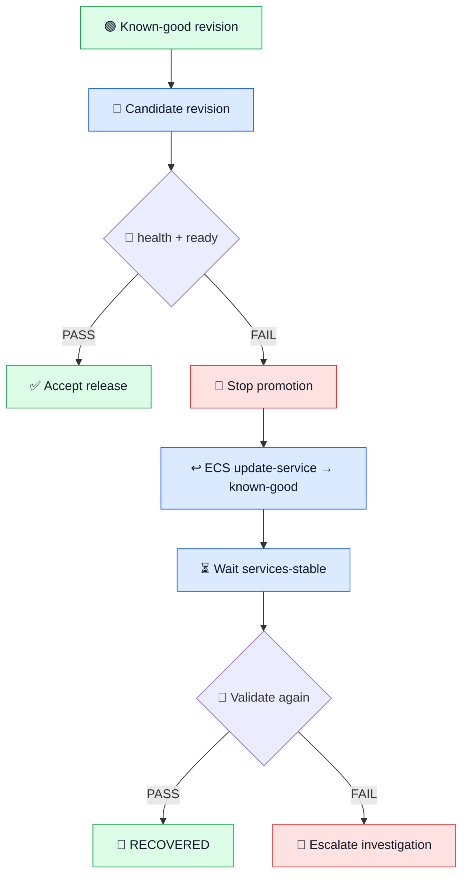

# ↩️ Phase 06 — Rollback & Recovery Runbook

<p align="center">


</p>

> [!IMPORTANT]
> Use this runbook when a new ECS revision reaches the service but fails post-deployment validation. **`/api/health = 200` alone is not enough to promote a release.**

## 🚦 Decision panel

| Signal | Meaning | Action |
|---|---|---|
| ❤️ health `200` + 💚 ready `200` | workload is alive and DB-ready | 🟢 **ACCEPT** |
| ❤️ health `200` + 💔 ready `503` | process alive, dependency unavailable | 🔴 **ROLL BACK** |
| 💔 health fails | application/runtime failure | 🔴 **ROLL BACK + INVESTIGATE** |

## 🧠 Recovery model



## 1️⃣ Capture the known-good revision

🎯 **Goal:** establish a concrete recovery target *before* touching the candidate release.

```powershell
$CLUSTER="madar-p06-cluster"; $SERVICE="madar-p06-service"; $REGION="us-east-1"; $GOOD=(aws ecs describe-services --cluster $CLUSTER --services $SERVICE --region $REGION --query 'services[0].taskDefinition' --output text); Write-Host "Known-good: $GOOD"
```

🧠 **Why:** rollback is unsafe if I cannot identify what “good” means.  
✅ **Expected:** an ECS task-definition ARN such as the validated `madar-p06-app:3`.

## 2️⃣ Deploy / observe the candidate

For normal releases, `.github/workflows/ci.yml` registers the new revision and updates the service automatically.

```powershell
aws ecs wait services-stable --cluster $CLUSTER --services $SERVICE --region $REGION
```

🎯 **What:** waits until ECS finishes deployment/replacement activity.  
⚠️ **Important:** “service stable” does not prove the database dependency works; application validation comes next.

## 3️⃣ Validate both operational signals

```powershell
curl.exe -i http://<ALB-DNS>/api/health
curl.exe -i http://<ALB-DNS>/api/ready
```

| Check | Expected |
|---|---:|
| ❤️ `/api/health` | `HTTP 200` |
| 💚 `/api/ready` | `HTTP 200` |

> [!CAUTION]
> If health succeeds but readiness returns `503`, **do not promote the release**. The Flask process is alive, but the workload is not ready to serve real traffic.

## 4️⃣ Roll back

```powershell
aws ecs update-service --cluster $CLUSTER --service $SERVICE --task-definition $GOOD --region $REGION --query 'service.{Service:serviceName,TaskDefinition:taskDefinition,Desired:desiredCount}' --output table
aws ecs wait services-stable --cluster $CLUSTER --services $SERVICE --region $REGION
```

🎯 **What:** repoints the ECS service to the captured known-good task definition.  
🧠 **Why:** recovery uses a previously validated artifact instead of guessing a new fix during an incident.  
✅ **Expected:** ECS settles on the known-good revision.

## 5️⃣ Prove recovery

```powershell
curl.exe -i http://<ALB-DNS>/api/health
curl.exe -i http://<ALB-DNS>/api/ready
```

> [!TIP]
> Do not call the incident recovered until **both** signals are green again.

## 🧪 Validated Phase 06 failure drill

```text
🟢 madar-p06-app:3   KNOWN GOOD
          ↓
🔴 madar-p06-app:4   CONTROLLED BAD REVISION
          ↓
❤️ /api/health       200
💔 /api/ready        503  ← EXPECTED FAILURE
          ↓
🚨 release gate      FAILURE DETECTED
          ↓
↩️ rollback           :4 → :3
          ↓
❤️ /api/health       200
💚 /api/ready        200 · database connected
          ↓
🏁 RECOVERY VALIDATED
```

The controlled workflow changed only `MADAR_DB_HOST` to `controlled-failure.invalid`. This was a deliberate configuration failure, not a fabricated production incident.

📸 **Evidence:** [`phase06-controlled-failure-rollback-success.png`](../evidence/phase06-controlled-failure-rollback-success.png)

## 🧯 If rollback does not recover readiness

Investigate in this order instead of registering random revisions:

| Order | 🔎 Check | What it tells me |
|---:|---|---|
| 1 | ⚙️ ECS service events / running tasks | deployment/runtime state |
| 2 | ⚖️ Target-group health | ALB → task reachability |
| 3 | 📜 `/ecs/madar-p06` logs | application/runtime errors |
| 4 | 🗄️ `MADAR_DB_HOST` | database endpoint configuration |
| 5 | 🔐 Secret reference / execution role | credential injection/access |
| 6 | 🔒 ECS SG → RDS SG `5432` | network authorization path |
| 7 | 🐘 RDS status | database availability |

## 🏁 Recovery exit gate

- 🟢 ECS service stable
- 🟢 known-good task definition active
- 🟢 `/api/health = 200`
- 🟢 `/api/ready = 200`
- 🟢 database connected
- 📸 failure/recovery evidence recorded

---

<p align="center"><strong>🔴 Detect → 🛑 Stop → ↩️ Roll back → 🟢 Validate → 📸 Record</strong></p>
