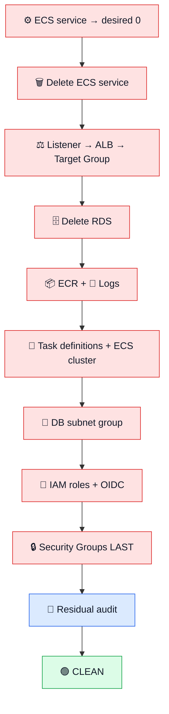

# 🧹 Phase 06 — Cleanup & Residual Audit Runbook

<p align="center">


</p>

> [!IMPORTANT]
> Cleanup is an engineering **exit gate**, not an optional afterthought. Delete only Phase 06 resources and verify dependencies before every destructive action.

## 🛑 Protected assets — NEVER delete during Phase 06 cleanup

| Asset | ID / name | State |
|---|---|---:|
| 💿 Phase 03 AMI | `ami-0cbd2e9ec0d6f9168` | 🟡 **KEEP** |
| 📸 Phase 03 snapshot | `snap-0920a020c47fb6447` | 🟡 **KEEP** |
| 🪣 Operational S3 | `madar-operational-files-197821101770` | 🟡 **KEEP** |
| 🌐 Default VPC | `vpc-015017581b8954e61` | 🟡 **KEEP** |
| 🧩 Default subnets | `us-east-1` defaults | 🟡 **KEEP** |

> [!CAUTION]
> A cleanup command returning an error is **not** permission to force-delete something else. Inspect the dependency first.

## 🧠 Dependency-safe deletion path



## 1️⃣ ⚙️ Stop and remove ECS service

```powershell
aws ecs update-service --cluster madar-p06-cluster --service madar-p06-service --desired-count 0 --region us-east-1 --query 'service.{Service:serviceName,Desired:desiredCount,Running:runningCount}' --output table
aws ecs delete-service --cluster madar-p06-cluster --service madar-p06-service --force --region us-east-1
```

🎯 **What:** stops tasks, then removes the service.  
🧠 **Why first:** tasks/ENIs must release before networking can be removed cleanly.  
✅ **Expected:** desired/running count reaches zero and service enters deletion/draining.

## 2️⃣ ⚖️ Delete the ALB chain

🔴 Delete in this exact order:

```text
Listener → Load Balancer → Target Group
```

Use current ARNs from `aws elbv2 describe-*`; never reuse an ARN from a deleted lab. Wait for AWS to release load-balancer network dependencies before deleting related SGs.

## 3️⃣ 🗄️ Delete disposable Phase 06 RDS

```powershell
aws rds delete-db-instance --db-instance-identifier madar-p06-postgres --skip-final-snapshot --delete-automated-backups --region us-east-1
aws rds wait db-instance-deleted --db-instance-identifier madar-p06-postgres --region us-east-1
```

🧠 **Why no final snapshot here:** the authoritative source dump is intentionally retained in the Phase 03 S3 bucket.  
⚠️ **Production warning:** do not copy this retention choice to a real production database without an explicit backup/retention decision.

## 4️⃣ 📦 Delete ECR + 📜 CloudWatch log group

```powershell
aws ecr delete-repository --repository-name madar-phase06 --force --region us-east-1
aws logs delete-log-group --log-group-name /ecs/madar-p06 --region us-east-1
```

🔴 `--force` deletes images inside the **disposable Phase 06 ECR repository**.

## 5️⃣ 🧾 Deregister task definitions + delete cluster

```powershell
aws ecs list-task-definitions --family-prefix madar-p06-app --region us-east-1 --output table
```

Deregister every active Phase 06 revision, then:

```powershell
aws ecs delete-cluster --cluster madar-p06-cluster --region us-east-1
```

✅ Validated Phase 06 had revisions `:1` through `:4`; all ended `INACTIVE`.

## 6️⃣ 🧩 Delete DB subnet group

Only after RDS is fully gone:

```powershell
aws rds delete-db-subnet-group --db-subnet-group-name madar-p06-db-subnets --region us-east-1
```

## 7️⃣ 🔑 IAM + OIDC cleanup

Temporary Phase 06 identities:

| Identity | Final state |
|---|---:|
| `MADAR-Phase06-GitHubActionsRole` | 🗑️ **DELETE** |
| `MADAR-Phase06-ECSTaskExecutionRole` | 🗑️ **DELETE** |
| `MADAR-Phase06-RestoreTaskRole` | 🗑️ **DELETE** |
| GitHub OIDC provider | 🗑️ **DELETE** |

Remove inline policies and managed-policy attachments **before** deleting roles. Confirm the RDS-managed secret disappears after RDS deletion, but never print its value.

## 8️⃣ 🔒 Security Groups LAST

| Layer | Validated SG | Action |
|---|---|---:|
| ⚖️ ALB | `sg-0f568ca8195cf7208` | 🗑️ DELETE |
| ⚙️ ECS | `sg-0f9a3569ed217bb1b` | 🗑️ DELETE |
| 🗄️ RDS | `sg-0057bae3ba8d11449` | 🗑️ DELETE |

> [!WARNING]
> `DependencyViolation` means an ENI or reference still exists. **Do not hide the error.** Inspect ENIs/SG references, wait for AWS-managed dependencies to release, then retry.

## 9️⃣ 🔎 Final regional residual audit

This command is an **audit**, not a deletion script:

```powershell
$R="us-east-1"; Write-Host "`n========== PHASE 06 — FINAL CLEANUP ==========" -ForegroundColor Cyan; $checks=@(@("EC2 Instances",{aws ec2 describe-instances --region $R --filters "Name=instance-state-name,Values=pending,running,stopping,stopped" --query 'Reservations[].Instances[].InstanceId' --output text}),@("ECS Clusters",{aws ecs list-clusters --region $R --query 'clusterArns[]' --output text}),@("ECR Repositories",{aws ecr describe-repositories --region $R --query 'repositories[].repositoryName' --output text}),@("RDS Databases",{aws rds describe-db-instances --region $R --query 'DBInstances[].DBInstanceIdentifier' --output text}),@("Load Balancers",{aws elbv2 describe-load-balancers --region $R --query 'LoadBalancers[].LoadBalancerName' --output text}),@("NAT Gateways",{aws ec2 describe-nat-gateways --region $R --filter "Name=state,Values=available,pending" --query 'NatGateways[].NatGatewayId' --output text}),@("Elastic IPs",{aws ec2 describe-addresses --region $R --query 'Addresses[].PublicIp' --output text}),@("Non-Default Security Groups",{aws ec2 describe-security-groups --region $R --query 'SecurityGroups[?GroupName!=`default`].GroupId' --output text})); foreach($c in $checks){$x=(& $c[1] 2>&1 | Out-String).Trim(); if([string]::IsNullOrWhiteSpace($x) -or $x -eq "None"){Write-Host ("[DELETED / CLEAN]  " + $c[0]) -ForegroundColor Green}else{Write-Host ("[FOUND]            " + $c[0] + " -> " + $x) -ForegroundColor Red}}; Write-Host "`n========== CLEANUP AUDIT COMPLETE ==========" -ForegroundColor Cyan
```

### 🎨 How to read the dashboard

- 🟢 **`[DELETED / CLEAN]`** → desired result.
- 🔴 **`[FOUND]`** → inspect before taking action.
- 🟡 Phase 03 continuity assets → intentionally retained.

## ✅ Validated final state

| Category | Result |
|---|---:|
| EC2 / ECS / ECR | 🟢 **CLEAN** |
| RDS / Secrets | 🟢 **CLEAN** |
| ALB / target groups | 🟢 **CLEAN** |
| NAT / EIP / ENIs | 🟢 **CLEAN** |
| Phase 06 log groups | 🟢 **CLEAN** |
| Phase 06 non-default SGs | 🟢 **CLEAN** |
| Phase 03 AMI / snapshot / S3 | 🟡 **RETAINED** |
| Default VPC / subnets | 🟡 **RETAINED** |

> [!NOTE]
> Snapshot/S3 storage may still incur storage cost and Cost Explorer can lag. A clean runtime audit is not the same as claiming an absolute real-time `$0` bill.

📸 **Evidence:** [`phase06-final-cleanup-verification.png`](../evidence/phase06-final-cleanup-verification.png)

## 🏁 Cleanup exit gate

- 🟢 temporary Phase 06 runtime gone
- 🟢 IAM/OIDC delivery identities removed
- 🟢 Phase 06 SGs gone
- 🟡 default VPC/subnets preserved
- 🟡 Phase 03 AMI/snapshot/S3 preserved
- 📸 residual audit recorded
- 💰 billing checked separately with reporting-lag awareness

---

<p align="center"><strong>🔴 Delete only Phase 06 → 🟡 Protect continuity assets → 🟢 Audit clean</strong></p>
